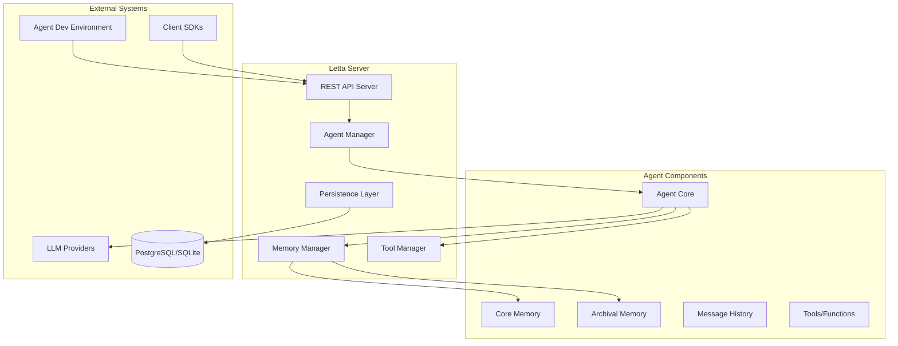
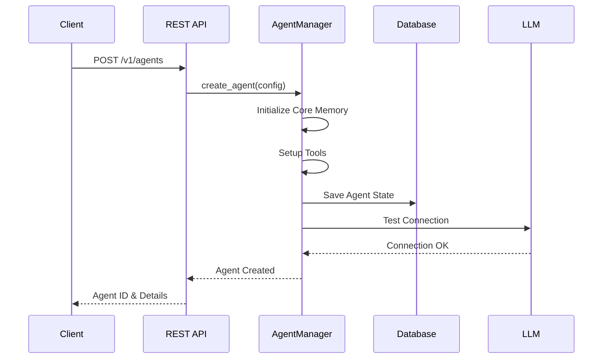
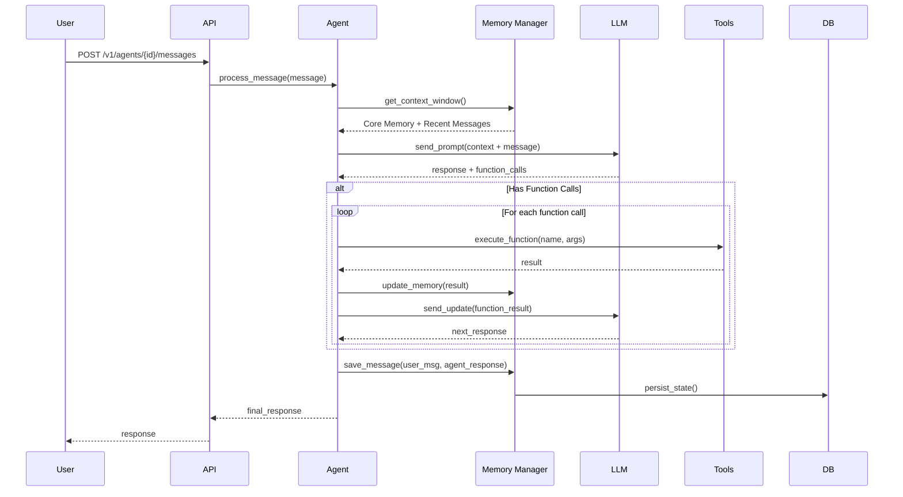
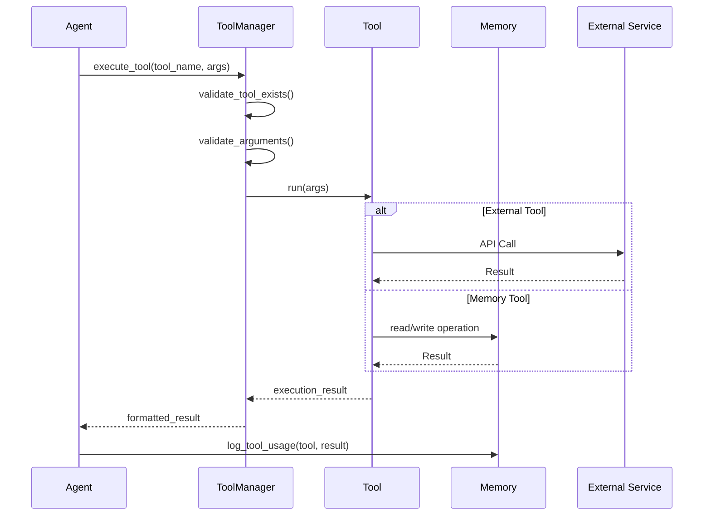
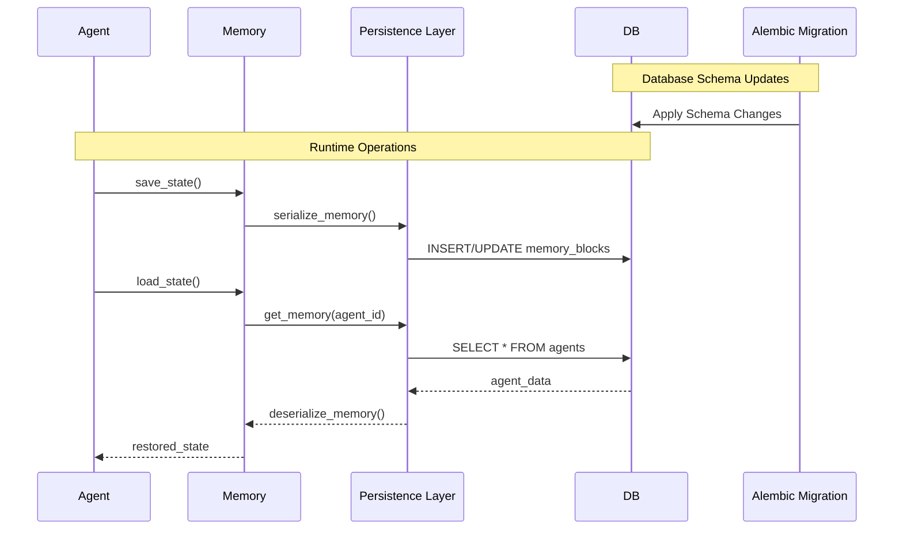
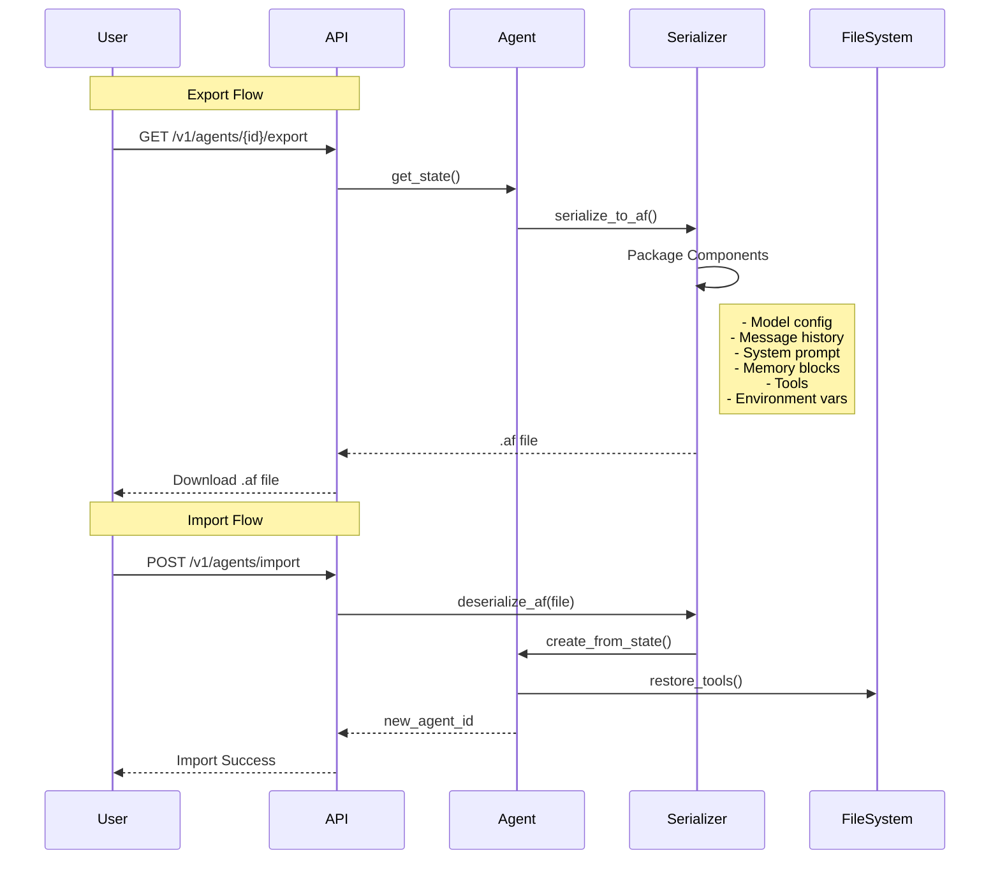

# Letta (formerly MemGPT) Codebase Analysis

## Executive Summary

Letta is an open-source framework for building **stateful agents** with advanced reasoning capabilities and transparent long-term memory. Originally known as MemGPT, it provides a white-box, model-agnostic solution for creating AI agents that can maintain context across conversations and persist their state indefinitely.

## Core Architecture Overview

### 1. Key Components



### 2. Memory Architecture

Letta implements a sophisticated memory system inspired by the MemGPT paper:

- **Core Memory**: In-context memory that's always available to the agent
  - Personality block
  - Human/User block
  - Custom blocks
- **Archival Memory**: Long-term storage for information overflow
- **Message History**: Conversation history with context window management

## Project Structure

```
letta/
├── alembic/              # Database migrations
├── assets/               # Static assets
├── certs/                # SSL certificates
├── db/                   # Database utilities
├── examples/             # Example implementations
├── letta/                # Main source code
│   ├── agent/            # Agent implementation
│   ├── memory/           # Memory management
│   ├── persistence/      # Database persistence
│   ├── server/           # REST API server
│   ├── tools/            # Tool system
│   └── utils/            # Utilities
├── tests/                # Test suite
├── scripts/              # Utility scripts
└── docker/               # Docker configurations
```

## Sequence Diagrams

### 1. Agent Creation Flow



### 2. Message Processing & Memory Management



### 3. Tool Execution Flow



### 4. Memory Persistence & Migration



### 5. Agent Export/Import (.af format)



## Key System Components

### 1. Agent Core
- **Purpose**: Central orchestrator for agent behavior
- **Responsibilities**:
  - Message processing
  - LLM interaction
  - Tool execution coordination
  - Memory management
  - State persistence

### 2. Memory System
- **Core Memory**: Always in context, editable personality and user information
- **Archival Memory**: Searchable long-term storage
- **Message History**: Conversation history with smart truncation

### 3. Tool System
- **Built-in Tools**:
  - `send_message`: Communicate with users
  - `core_memory_append/replace`: Edit core memory
  - `archival_memory_insert/search`: Manage long-term memory
  - `conversation_search`: Search message history
- **Custom Tools**: User-defined functions with JSON schema validation

### 4. Persistence Layer
- **PostgreSQL**: Production database with migration support
- **SQLite**: Development/lightweight deployment
- **Alembic**: Database migration management

### 5. REST API Server
- **FastAPI-based**: Modern async Python web framework
- **Authentication**: Token-based with optional password protection
- **Endpoints**:
  - Agent management (CRUD)
  - Message processing
  - Memory operations
  - Tool management
  - Import/Export

## Advanced Features

### 1. Stateful Agent Design
```python
# Pseudo-code representation of agent state
class AgentState:
    id: str
    model_config: ModelConfig
    core_memory: CoreMemory
    message_history: List[Message]
    tools: List[Tool]
    archival_memory: ArchivalMemory
    
    def process_message(self, message: str):
        # 1. Update context window
        # 2. Send to LLM
        # 3. Process function calls
        # 4. Update memory
        # 5. Return response
```

### 2. Memory Management Strategy
- **Context Window Management**: Smart truncation of message history
- **Memory Pressure Handling**: Automatic archival of old conversations
- **Memory Editing**: Direct manipulation of agent's core beliefs/knowledge

### 3. Tool Execution Security
- **Sandboxing**: Tools run in controlled environments
- **Validation**: JSON schema validation for all tool inputs
- **Permissions**: Configurable tool access per agent

## Integration Points

### 1. LLM Providers
- OpenAI API
- Anthropic Claude
- Local models (Ollama, vLLM)
- Custom endpoints

### 2. Client SDKs
- Python SDK (`letta-client`)
- TypeScript/Node.js SDK
- REST API for custom integrations

### 3. Deployment Options
- Docker containers
- Kubernetes
- Cloud services (AWS, GCP, Azure)
- Local development

## Best Practices & Patterns

### 1. Agent Design Patterns
- **Specialized Agents**: Create agents with specific expertise
- **Memory Templates**: Pre-configured memory blocks for common use cases
- **Tool Composition**: Combine tools for complex workflows

### 2. Production Deployment
- Use PostgreSQL for data persistence
- Enable authentication in production
- Regular backups of agent state
- Monitor memory usage and context windows

### 3. Development Workflow
- Use ADE for rapid prototyping
- Export/Import agents for version control
- Test tools in isolation
- Monitor agent reasoning through debug logs

## Conclusion

Letta represents a significant advancement in building stateful AI agents. Its architecture prioritizes:

1. **Transparency**: White-box approach to agent reasoning
2. **Persistence**: Durable agent state across sessions
3. **Flexibility**: Model-agnostic design
4. **Scalability**: Production-ready architecture
5. **Developer Experience**: Comprehensive tooling and SDKs

The framework's emphasis on memory management and state persistence makes it ideal for building sophisticated AI applications that require long-term context retention and complex reasoning capabilities.