# Letta Detailed Component Analysis & Sequence Diagrams

## Core Memory Management Deep Dive

### Core Memory Structure

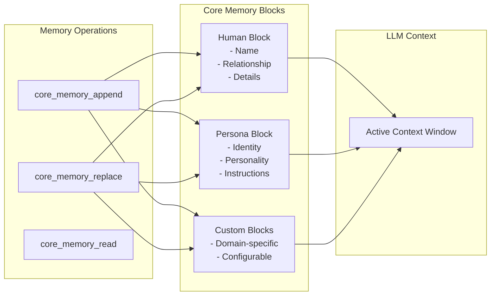

### Core Memory Update Sequence

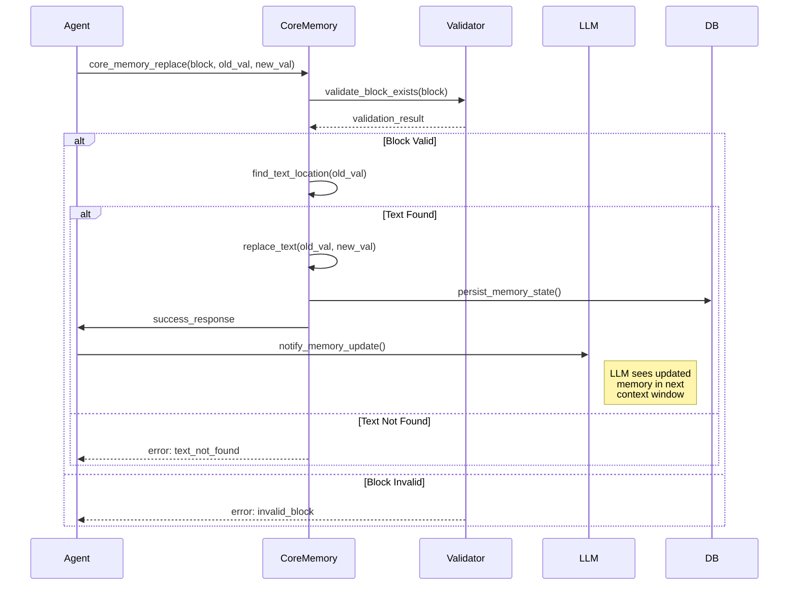

## Archival Memory System

### Archival Memory Architecture

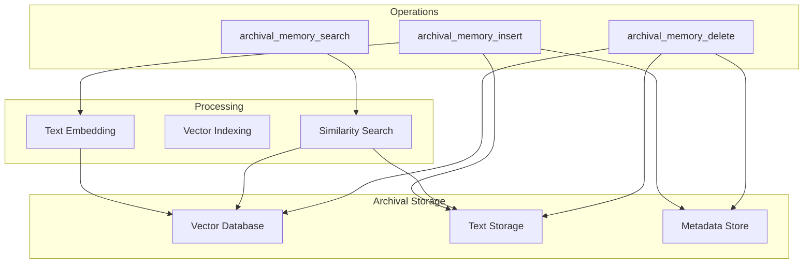

### Archival Memory Search Flow

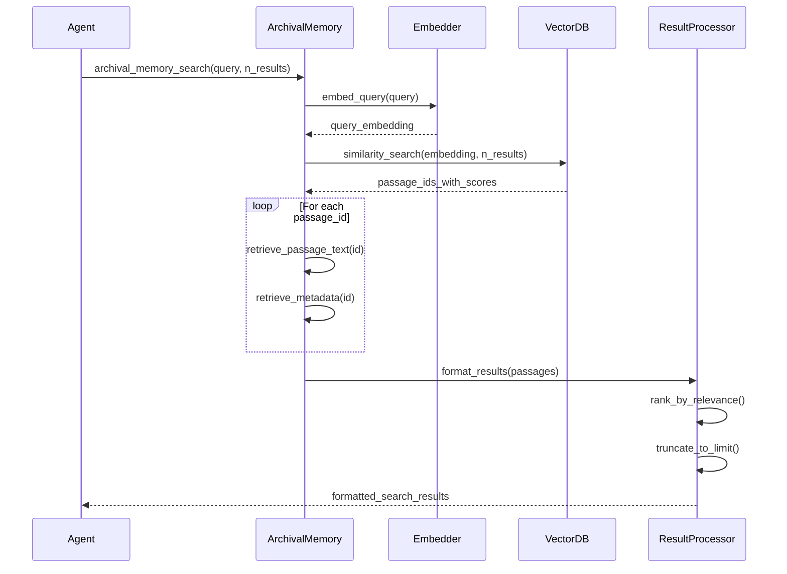

## Context Window Management

### Dynamic Context Window Assembly

```mermaid
sequenceDiagram
    participant Agent
    participant ContextManager
    participant MemorySelector
    participant MessageBuffer
    participant TokenCounter

    Agent->>ContextManager: prepare_context(new_message)
    
    ContextManager->>ContextManager: get_system_prompt()
    ContextManager->>ContextManager: get_core_memory()
    
    ContextManager->>TokenCounter: count_base_tokens(system + core)
    TokenCounter-->>ContextManager: base_token_count
    
    ContextManager->>ContextManager: calculate_available_tokens()
    Note right of ContextManager: max_tokens - base_tokens - buffer
    
    ContextManager->>MessageBuffer: get_recent_messages()
    
    loop Until token limit
        MessageBuffer->>TokenCounter: count_message_tokens(message)
        alt Fits in context
            MessageBuffer->>MessageBuffer: add_to_context(message)
        else Exceeds limit
            MessageBuffer->>MemorySelector: summarize_or_archive(message)
            break
        end
    end
    
    ContextManager->>ContextManager: assemble_final_context()
    ContextManager-->>Agent: complete_context_window
```

### Message History Truncation Strategy

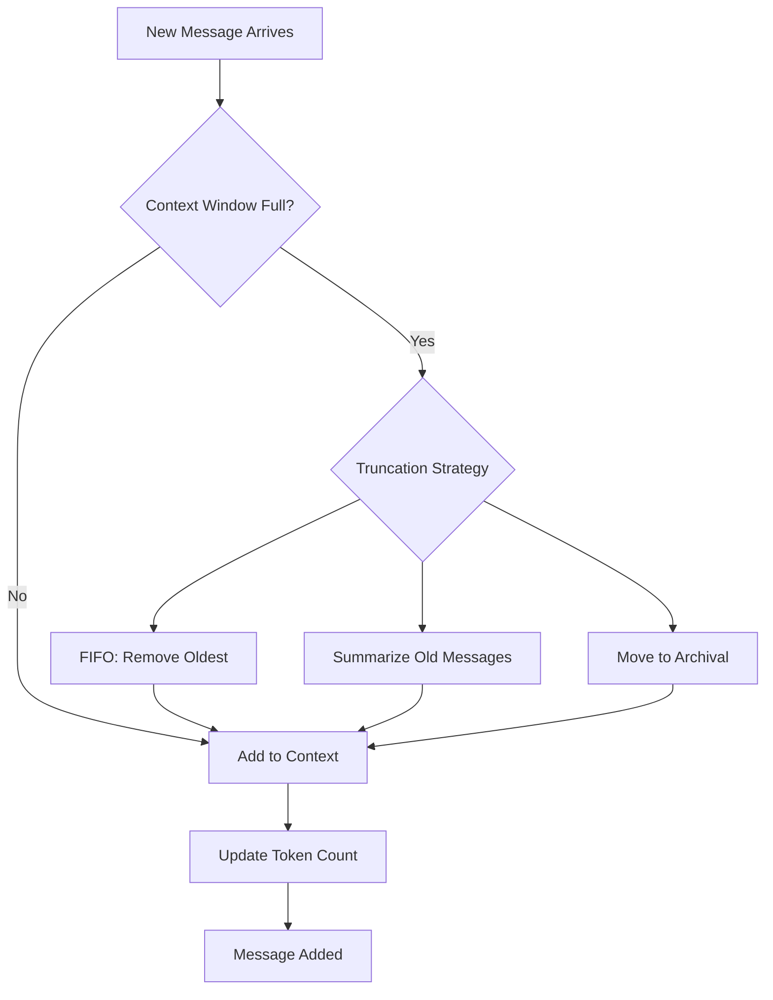

## Tool System Implementation

### Tool Registration & Discovery

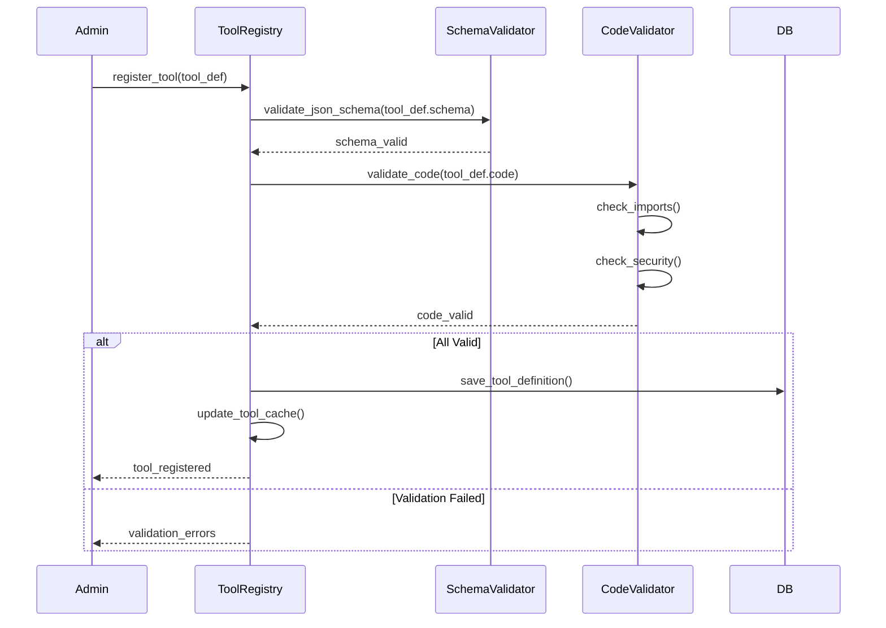

### Tool Execution Sandbox

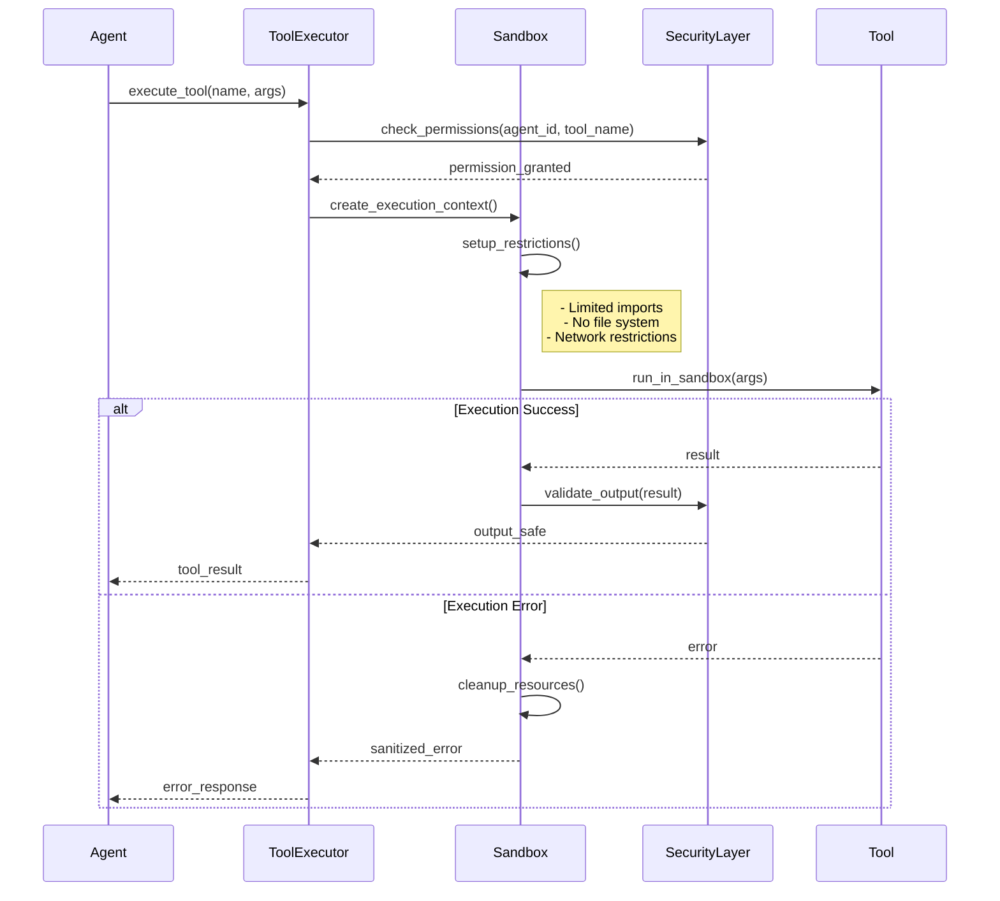

## Multi-Agent Communication

### Agent-to-Agent Messaging

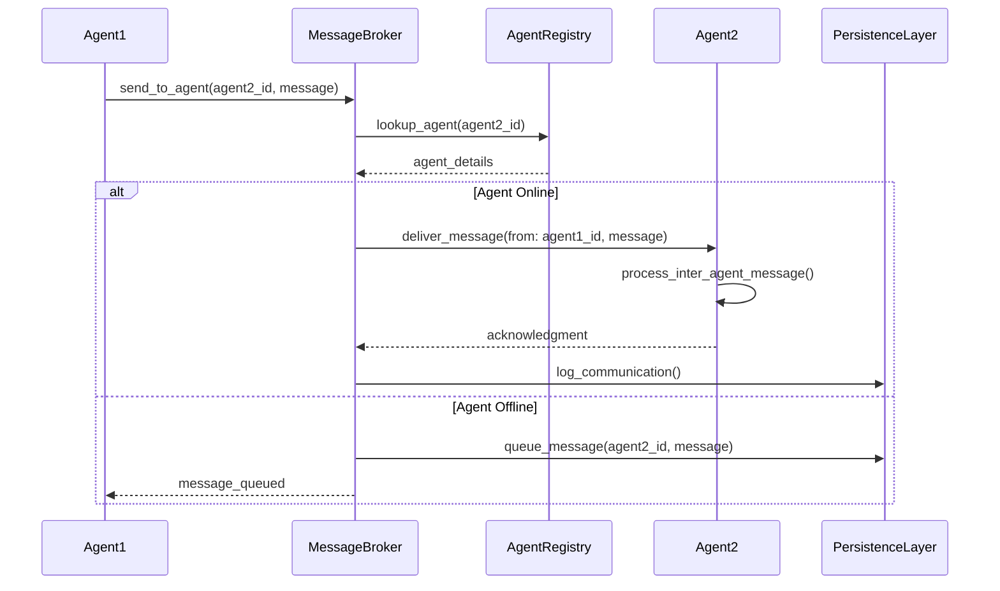

### Shared Memory Architecture

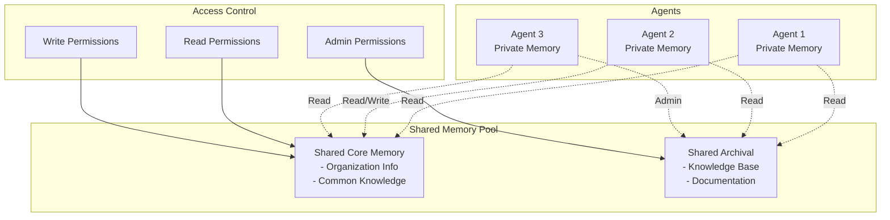

## Advanced Workflows

### Reasoning Chain with Memory Updates

```mermaid
sequenceDiagram
    participant User
    participant Agent
    participant ReasoningEngine
    participant Memory
    participant Tools
    participant LLM

    User->>Agent: Complex Query
    
    Agent->>ReasoningEngine: init_reasoning_chain(query)
    
    loop Reasoning Steps
        ReasoningEngine->>Memory: get_relevant_context()
        Memory-->>ReasoningEngine: context
        
        ReasoningEngine->>LLM: reason_step(context, query)
        LLM-->>ReasoningEngine: thought + action
        
        alt Tool Needed
            ReasoningEngine->>Tools: execute(action)
            Tools-->>ReasoningEngine: result
            ReasoningEngine->>Memory: store_intermediate_result()
        else Memory Update
            ReasoningEngine->>Memory: update_knowledge()
        else Final Answer
            ReasoningEngine->>ReasoningEngine: compile_answer()
            break
        end
    end
    
    ReasoningEngine-->>Agent: final_response
    Agent-->>User: Reasoned Answer
```

### Agent State Checkpointing

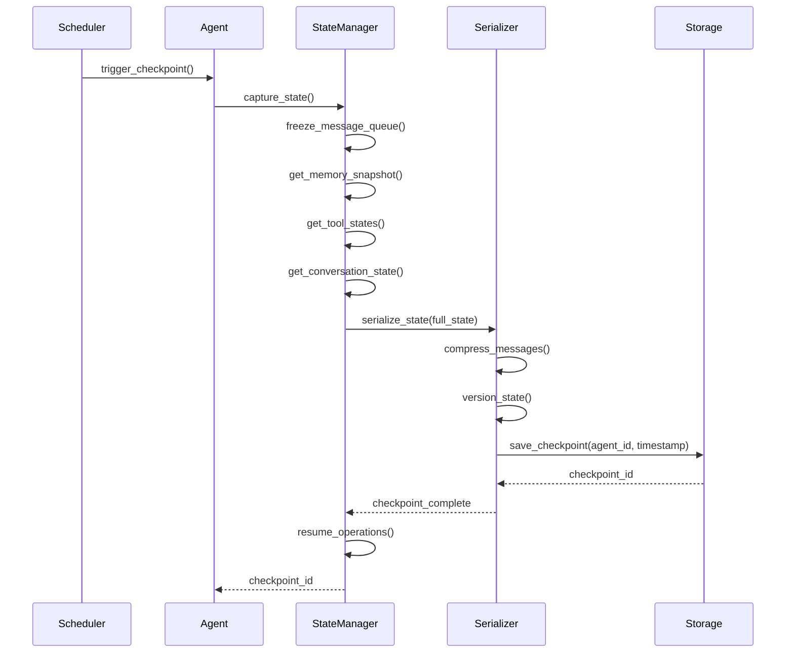

## Performance Optimization Patterns

### Lazy Loading Strategy

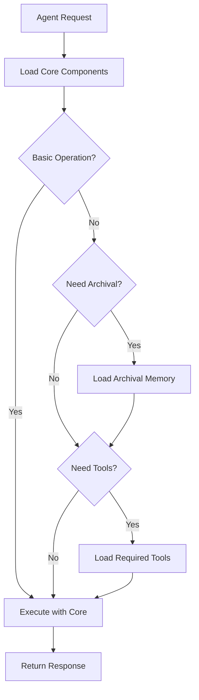

### Caching Architecture

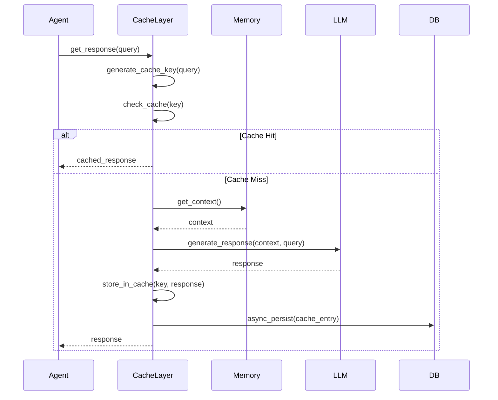

## Error Handling & Recovery

### Fault Tolerance Flow

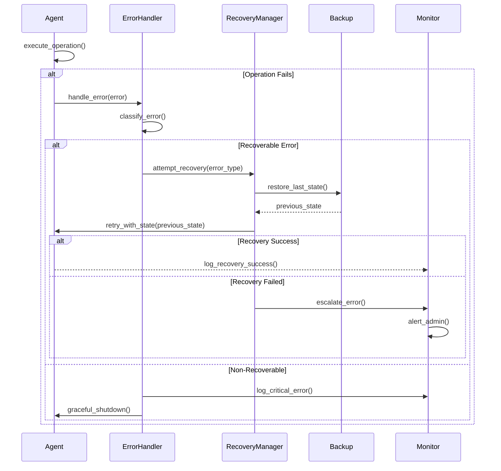

## Security & Access Control

### Authentication & Authorization Flow

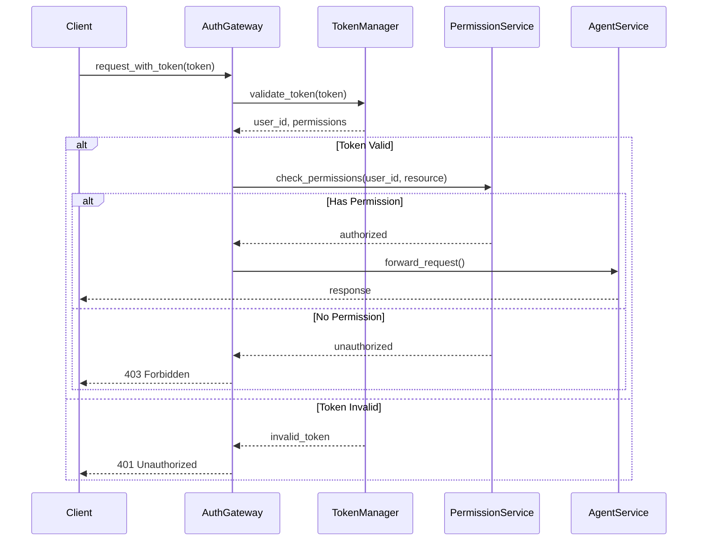

## Conclusion

These detailed sequence diagrams illustrate the sophisticated architecture of Letta, showing how various components interact to provide:

1. **Robust Memory Management**: Hierarchical memory system with core and archival storage
2. **Flexible Tool System**: Secure, validated tool execution with sandboxing
3. **Scalable Architecture**: Multi-agent communication and shared memory pools
4. **Performance Optimization**: Caching, lazy loading, and efficient context management
5. **Enterprise Features**: Security, fault tolerance, and state management

The system's design enables building complex, stateful AI applications that can maintain context over extended periods while remaining performant and secure.