# Pydantic-AI: Advanced Features and Patterns

## 1. Pydantic Graph System

Pydantic Graph provides a powerful way to define complex agent workflows using type hints.

### Graph Architecture

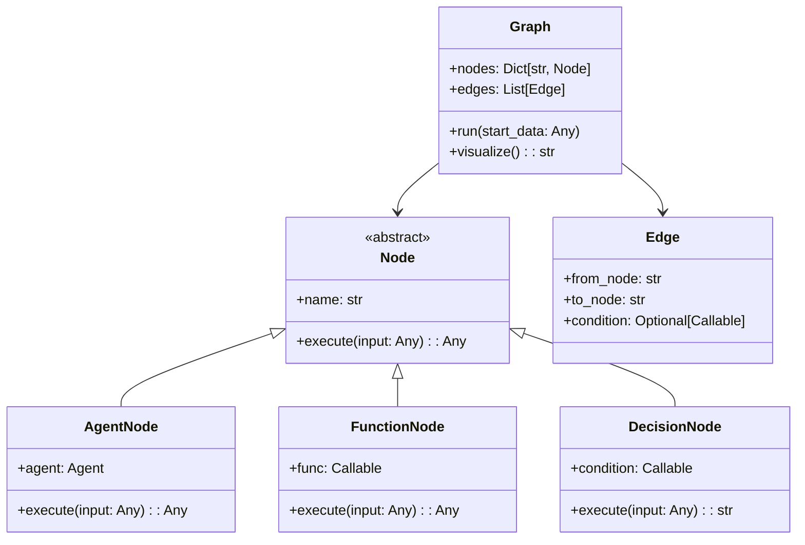

### Graph Execution Flow

```mermaid
sequenceDiagram
    participant User
    participant Graph
    participant NodeExecutor
    participant Node1[Start Node]
    participant Node2[Process Node]
    participant Decision[Decision Node]
    participant NodeA[Path A Node]
    participant NodeB[Path B Node]
    participant End[End Node]
    
    User->>Graph: run(initial_data)
    Graph->>NodeExecutor: Execute workflow
    
    NodeExecutor->>Node1: execute(initial_data)
    Node1-->>NodeExecutor: result1
    
    NodeExecutor->>Node2: execute(result1)
    Node2-->>NodeExecutor: result2
    
    NodeExecutor->>Decision: execute(result2)
    Decision-->>NodeExecutor: "path_a" or "path_b"
    
    alt Path A
        NodeExecutor->>NodeA: execute(result2)
        NodeA-->>NodeExecutor: resultA
    else Path B
        NodeExecutor->>NodeB: execute(result2)
        NodeB-->>NodeExecutor: resultB
    end
    
    NodeExecutor->>End: execute(final_result)
    End-->>Graph: final_output
    Graph-->>User: final_output
```

### Graph Definition Pattern

```python
from pydantic_graph import Graph, Node, edge

class AnalysisNode(Node):
    agent: Agent[AnalysisDeps, AnalysisResult]
    
    async def execute(self, input_data: InputData) -> AnalysisResult:
        return await self.agent.run(str(input_data))

class DecisionNode(Node):
    def execute(self, analysis: AnalysisResult) -> str:
        if analysis.risk_score > 0.7:
            return "high_risk_path"
        return "normal_path"

# Define graph
graph = Graph()
graph.add_node("start", DataPrepNode())
graph.add_node("analysis", AnalysisNode(agent=analysis_agent))
graph.add_node("decision", DecisionNode())
graph.add_node("high_risk", HighRiskHandler())
graph.add_node("normal", NormalHandler())

# Define edges
graph.add_edge("start", "analysis")
graph.add_edge("analysis", "decision")
graph.add_edge("decision", "high_risk", condition=lambda r: r == "high_risk_path")
graph.add_edge("decision", "normal", condition=lambda r: r == "normal_path")
```

## 2. Memory and Persistence System

### Conversation Memory Architecture

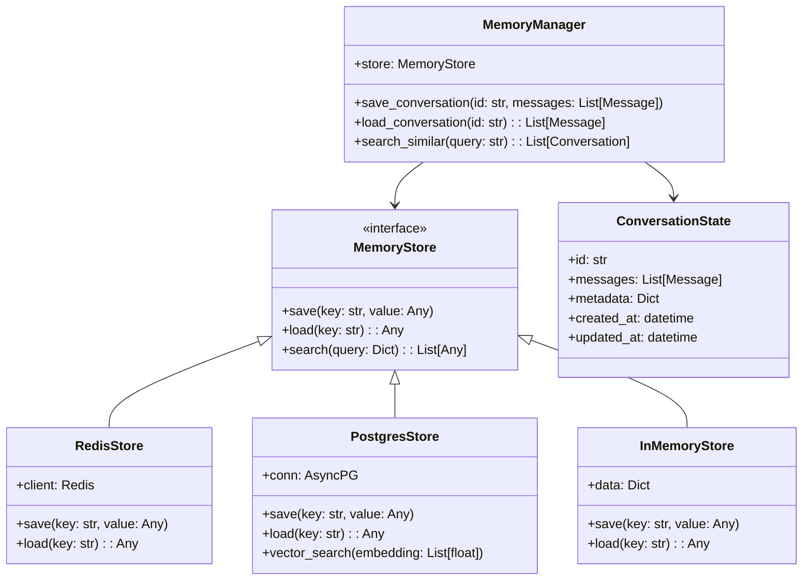

### Stateful Agent Pattern

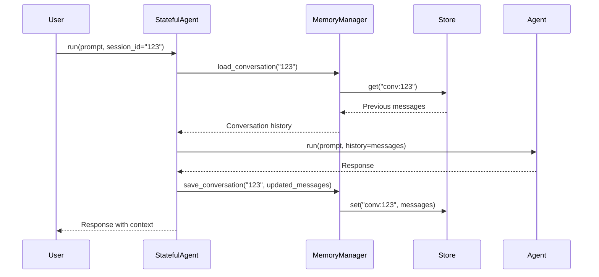

### Implementing Conversation Memory

```python
class StatefulAgent:
    def __init__(self, agent: Agent, memory: MemoryManager):
        self.agent = agent
        self.memory = memory
    
    async def run(
        self, 
        prompt: str, 
        session_id: str,
        deps: Any = None
    ) -> Result:
        # Load conversation history
        history = await self.memory.load_conversation(session_id)
        
        # Build context with history
        context_prompt = self._build_context(history, prompt)
        
        # Run agent with context
        result = await self.agent.run(context_prompt, deps)
        
        # Save updated conversation
        updated_history = history + [
            UserMessage(content=prompt),
            AssistantMessage(content=result.output)
        ]
        await self.memory.save_conversation(session_id, updated_history)
        
        return result
```

## 3. Multi-Agent Orchestration

### Orchestration Patterns

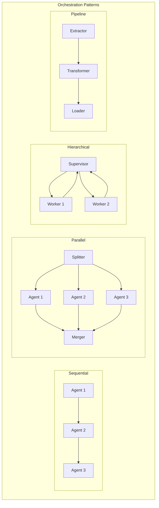

### Multi-Agent Communication

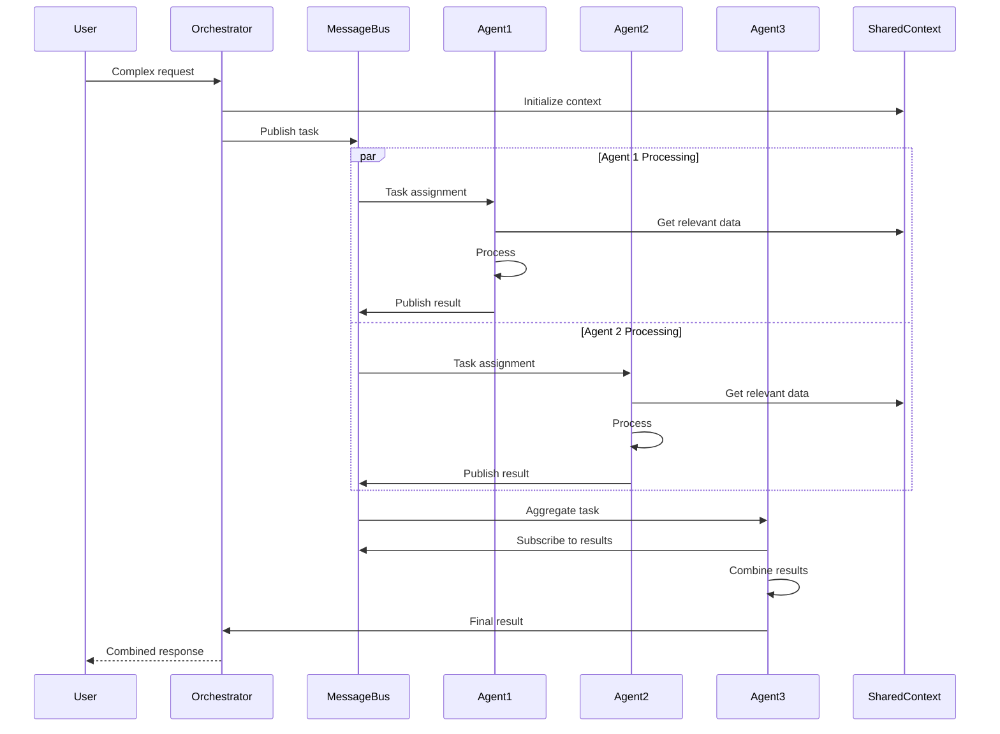

### Agent Communication Protocol

```python
@dataclass
class AgentMessage:
    sender: str
    receiver: str
    content: Any
    message_type: Literal["request", "response", "broadcast"]
    correlation_id: str
    timestamp: datetime

class MessageBus:
    def __init__(self):
        self._subscribers: Dict[str, List[Callable]] = {}
        self._message_queue: asyncio.Queue = asyncio.Queue()
    
    async def publish(self, message: AgentMessage):
        await self._message_queue.put(message)
        await self._notify_subscribers(message)
    
    def subscribe(self, agent_id: str, handler: Callable):
        self._subscribers.setdefault(agent_id, []).append(handler)

class MultiAgentOrchestrator:
    def __init__(self, agents: Dict[str, Agent], bus: MessageBus):
        self.agents = agents
        self.bus = bus
        self._setup_subscriptions()
    
    async def execute_workflow(self, request: Any) -> Any:
        # Define workflow logic
        pass
```

## 4. Advanced Persistence Patterns

### Event Sourcing for Agent Actions

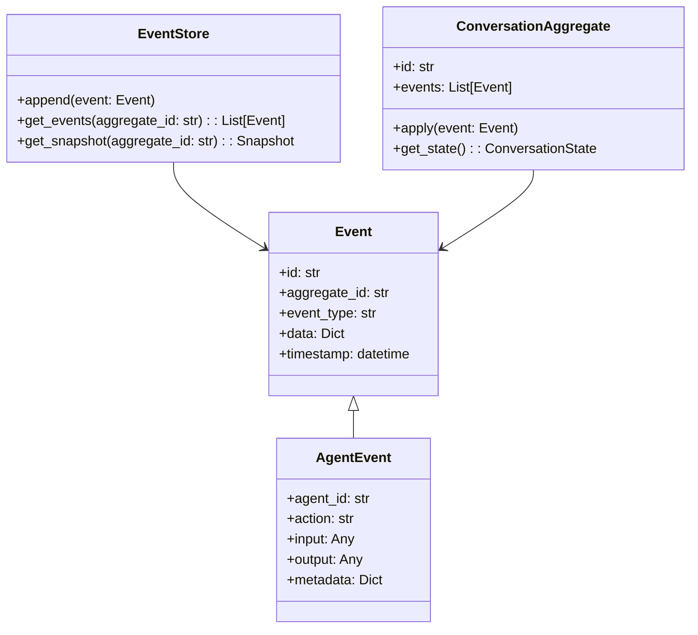

### Checkpointing and Recovery

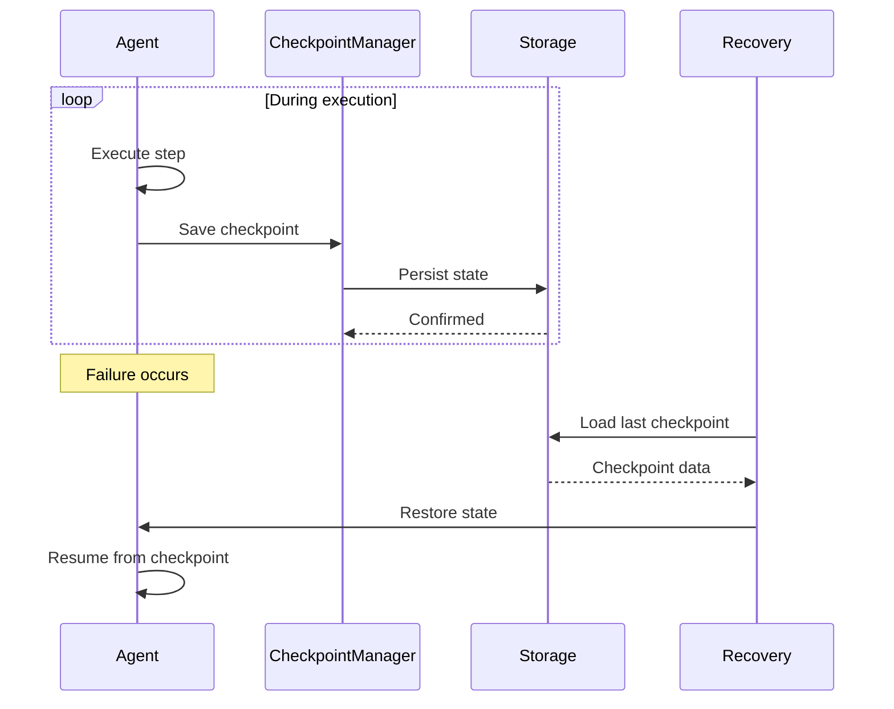

## 5. Semantic Router for Multi-Agent Systems

### Router Architecture

```mermaid
flowchart TD
    Input[User Input] --> Embedder[Text Embedder]
    Embedder --> Vector[Input Vector]
    
    Vector --> Similarity{Similarity Search}
    
    subgraph "Agent Registry"
        A1[Customer Service Agent<br/>Embedding: [...]]
        A2[Technical Support Agent<br/>Embedding: [...]]
        A3[Sales Agent<br/>Embedding: [...]]
    end
    
    Similarity --> A1
    Similarity --> A2
    Similarity --> A3
    
    Similarity --> Best[Best Match]
    Best --> Route[Route to Agent]
```

### Semantic Router Implementation

```python
class SemanticRouter:
    def __init__(self, embedder: Embedder):
        self.embedder = embedder
        self.routes: List[Route] = []
    
    def add_route(
        self, 
        agent: Agent, 
        description: str,
        examples: List[str]
    ):
        # Create embeddings for examples
        embeddings = [self.embedder.embed(ex) for ex in examples]
        
        route = Route(
            agent=agent,
            description=description,
            embeddings=embeddings
        )
        self.routes.append(route)
    
    async def route(self, query: str) -> Agent:
        query_embedding = self.embedder.embed(query)
        
        # Find best matching route
        best_route = max(
            self.routes,
            key=lambda r: max(
                cosine_similarity(query_embedding, e) 
                for e in r.embeddings
            )
        )
        
        return best_route.agent
```

## 6. Evaluation and Monitoring System

### Evaluation Framework

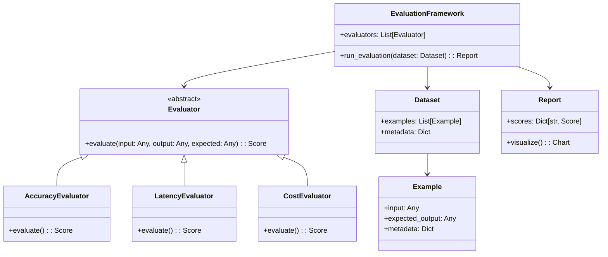

### Real-time Monitoring

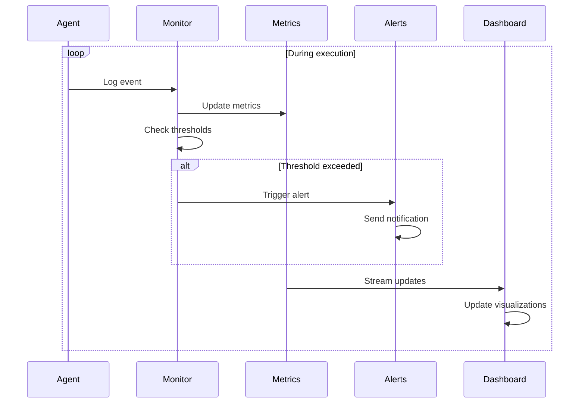

## 7. Advanced Tool Patterns

### Composite Tools

```python
class CompositeTool:
    """Tool that combines multiple sub-tools"""
    
    def __init__(self, tools: List[Tool]):
        self.tools = tools
    
    async def execute(self, ctx: RunContext, **kwargs) -> Any:
        results = {}
        
        # Execute tools in sequence or parallel
        for tool in self.tools:
            result = await tool.execute(ctx, **kwargs)
            results[tool.name] = result
        
        # Combine results
        return self._combine_results(results)
```

### Tool Middleware

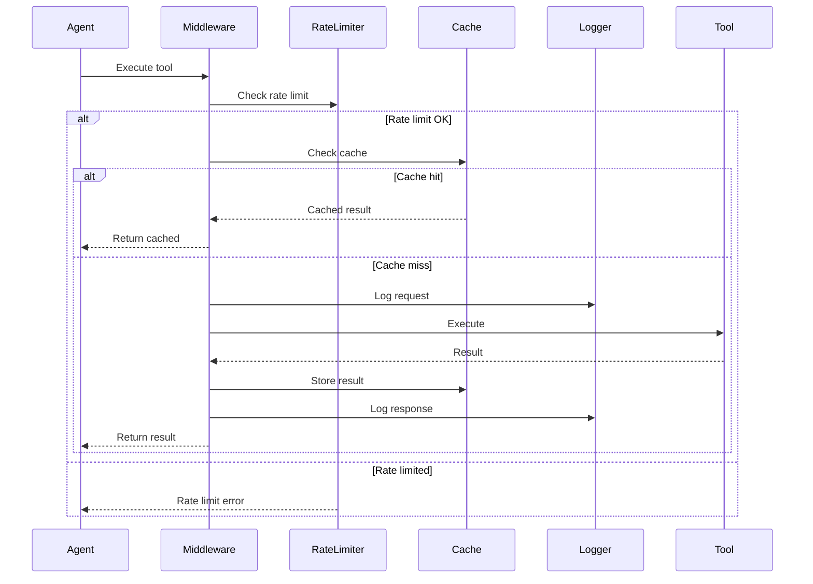

## 8. Advanced Streaming Patterns

### Stream Processing Pipeline

```python
class StreamProcessor:
    def __init__(self):
        self.transformers: List[StreamTransformer] = []
        self.aggregators: List[StreamAggregator] = []
    
    async def process_stream(
        self, 
        stream: AsyncIterator[Event]
    ) -> AsyncIterator[ProcessedEvent]:
        async for event in stream:
            # Apply transformations
            transformed = event
            for transformer in self.transformers:
                transformed = await transformer.transform(transformed)
            
            # Update aggregators
            for aggregator in self.aggregators:
                await aggregator.update(transformed)
            
            # Yield processed event
            yield ProcessedEvent(
                original=event,
                transformed=transformed,
                aggregates=self._get_aggregates()
            )
```

### Backpressure Handling

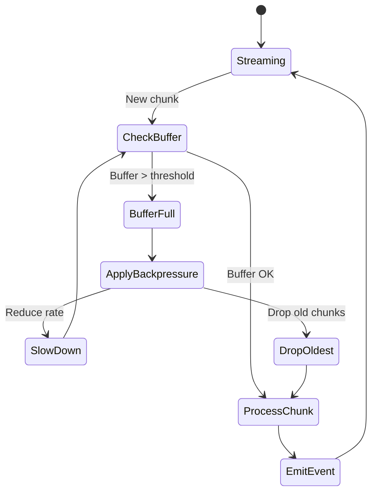