# Pydantic-AI: Comprehensive Architecture Analysis

## Table of Contents
1. [Overview](#overview)
2. [Core Architecture](#core-architecture)
3. [Agent Execution Flow](#agent-execution-flow)
4. [Tool System](#tool-system)
5. [Dependency Injection](#dependency-injection)
6. [Model Abstraction Layer](#model-abstraction-layer)
7. [Streaming and Response Management](#streaming-and-response-management)
8. [Messages and Chat History](#messages-and-chat-history)
9. [Output Validation](#output-validation)
10. [Error Handling and Retries](#error-handling-and-retries)
11. [Integration Points](#integration-points)

## Overview

Pydantic-AI is an agent framework designed to make building production-grade GenAI applications less painful. It follows a Python-centric design philosophy similar to FastAPI, leveraging Pydantic for validation and type safety.

### Key Design Principles:
- **Type Safety**: Extensive use of generics and type hints
- **Model Agnostic**: Supports multiple LLM providers through a unified interface
- **Dependency Injection**: Optional system for providing data and services
- **Structured Responses**: Uses Pydantic models for validated outputs
- **Streaming Support**: Real-time streaming with validation

## Core Architecture

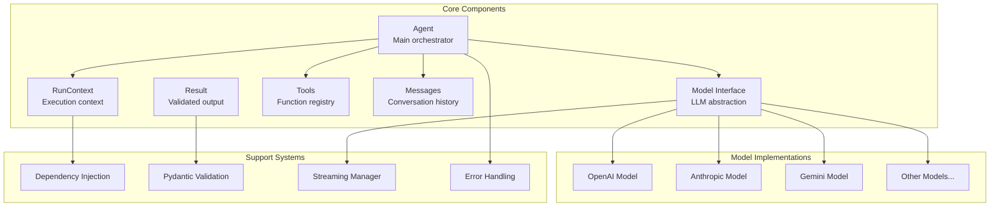

## Agent Execution Flow

The agent execution follows a sophisticated flow that handles tool calls, retries, and validation:

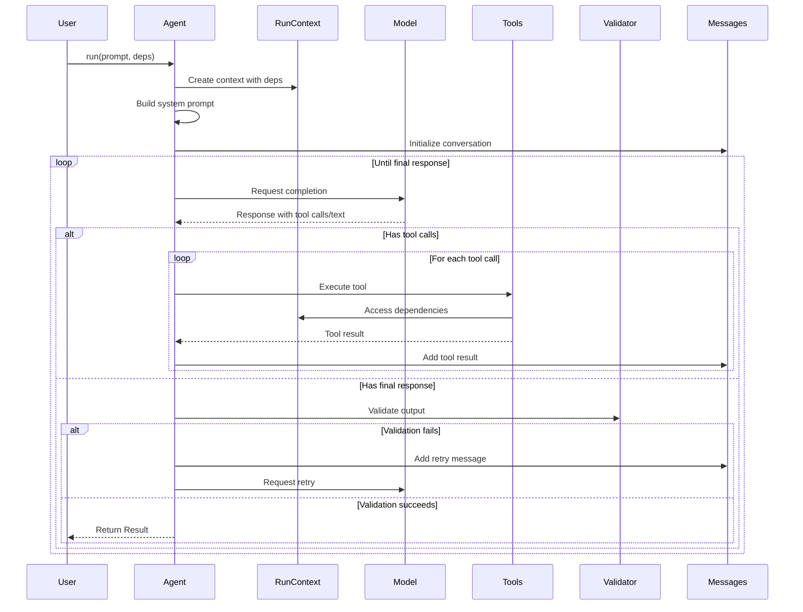

## Tool System

The tool system allows agents to call functions during execution:

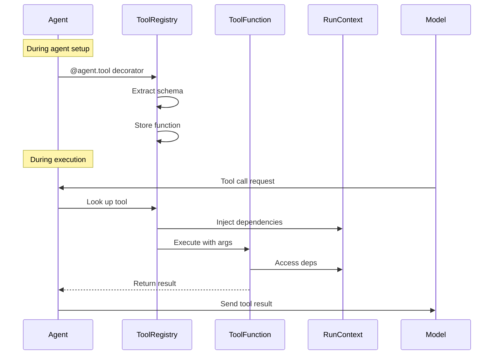

### Tool Schema Generation

```python
# Tool definition process
@agent.tool
async def get_balance(
    ctx: RunContext[BankDeps],
    include_pending: bool
) -> float:
    """Get customer balance."""
    # Function signature → JSON Schema
    # Docstring → Tool description
    # Parameters → Schema properties
```

## Dependency Injection

The dependency injection system provides type-safe access to external resources:

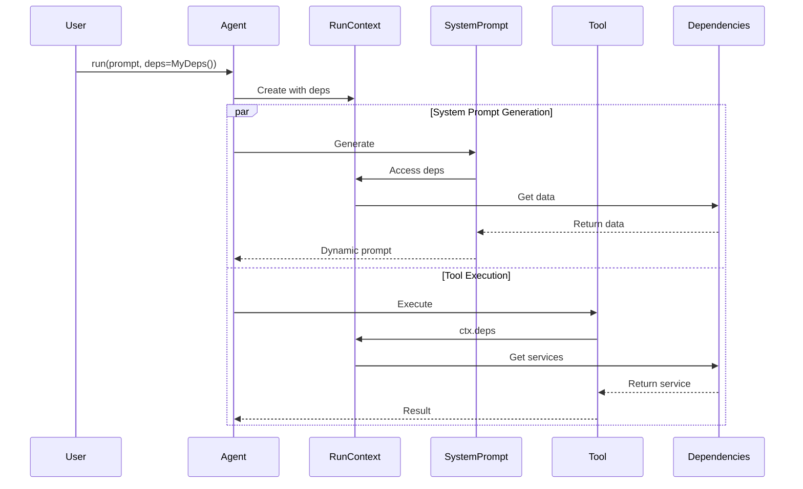

## Model Abstraction Layer

The model abstraction provides a unified interface for different LLM providers:

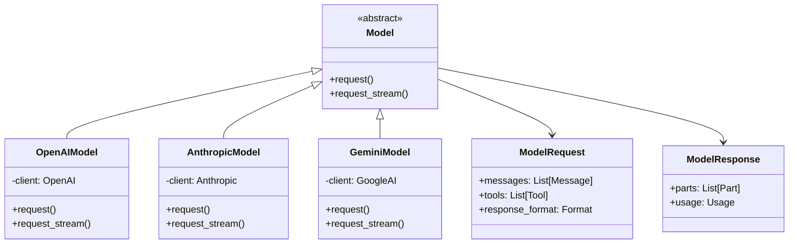

## Streaming and Response Management

The streaming system handles real-time responses with validation:

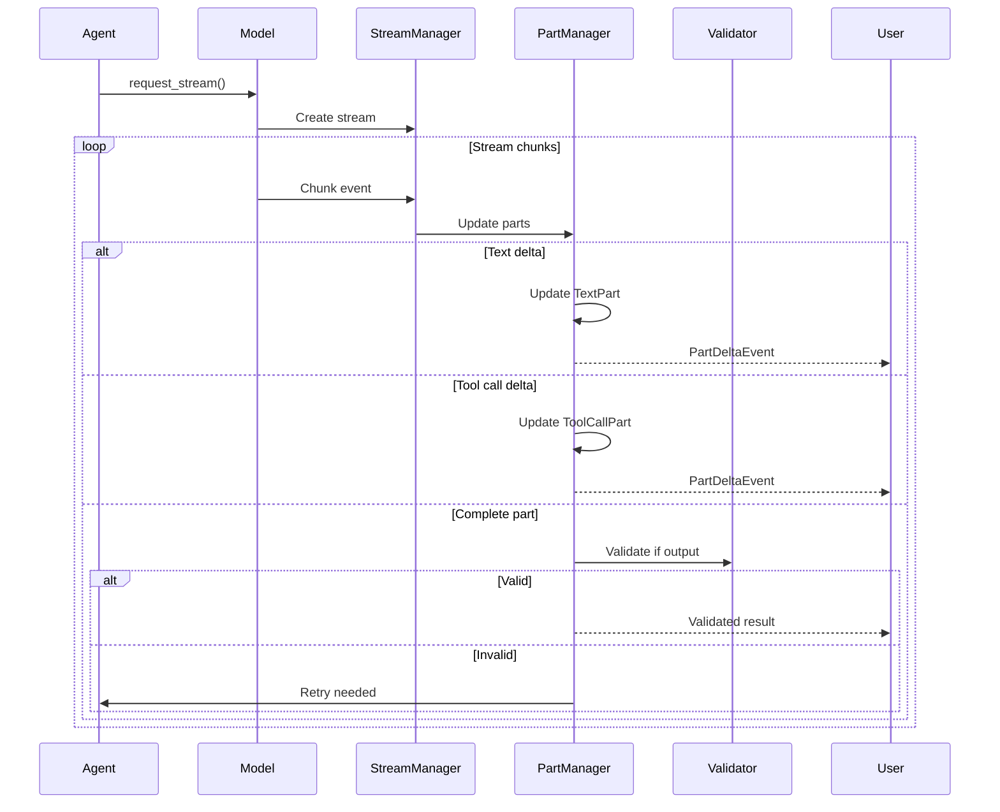

## Messages and Chat History

The message system maintains conversation state:

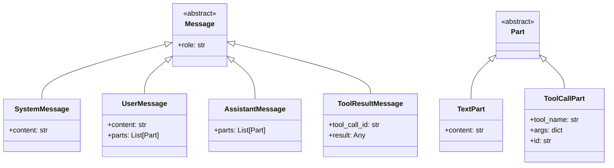

## Output Validation

Output validation ensures structured responses match expectations:

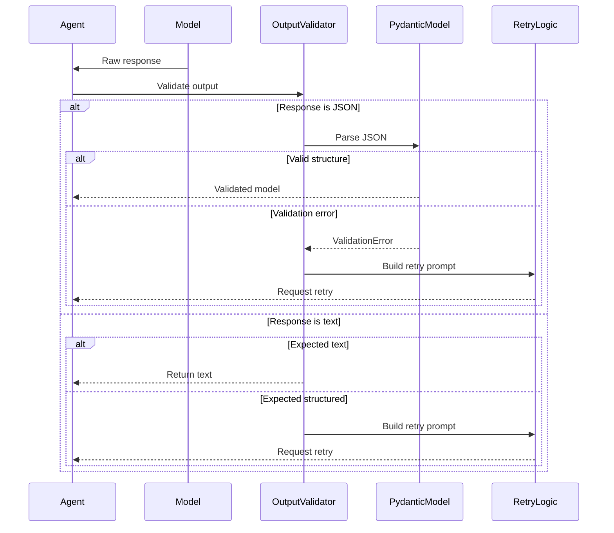

## Error Handling and Retries

The framework implements sophisticated error handling with automatic retries:

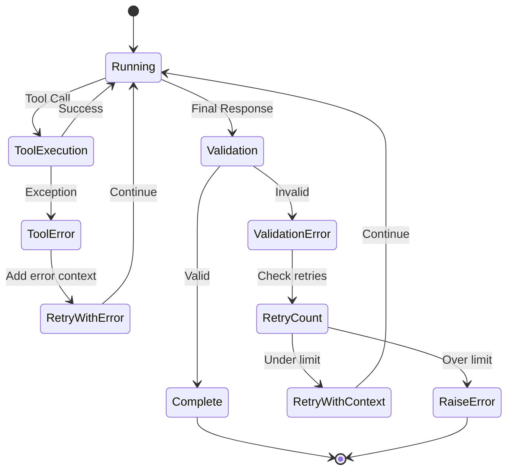

## Integration Points

### 1. Pydantic Logfire Integration

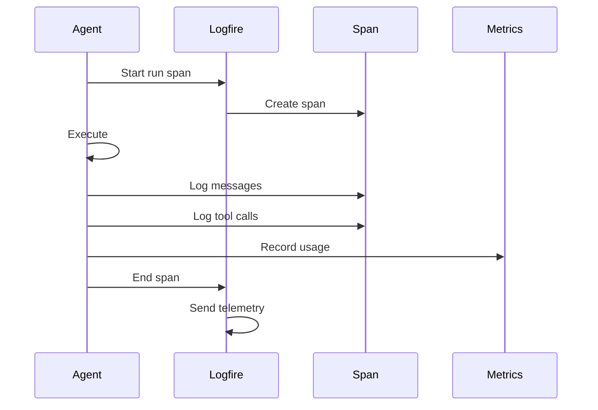

### 2. Model Provider Integration

Each model provider has specific implementation details:

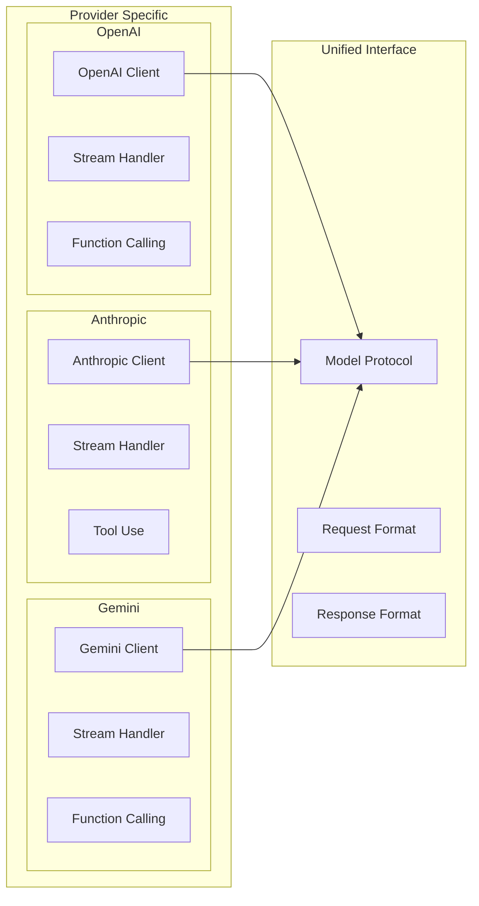

## Advanced Features

### 1. Multi-Agent Systems

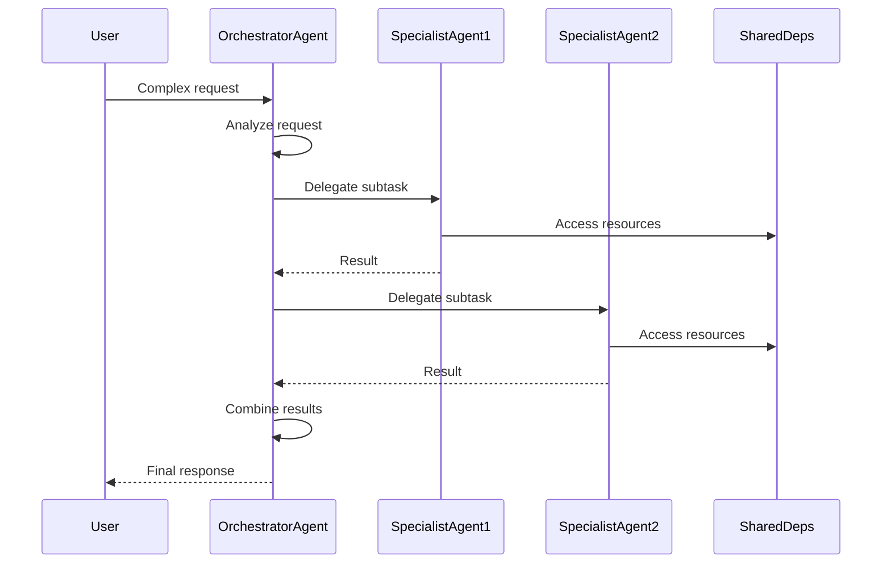

### 2. Graph-Based Workflows

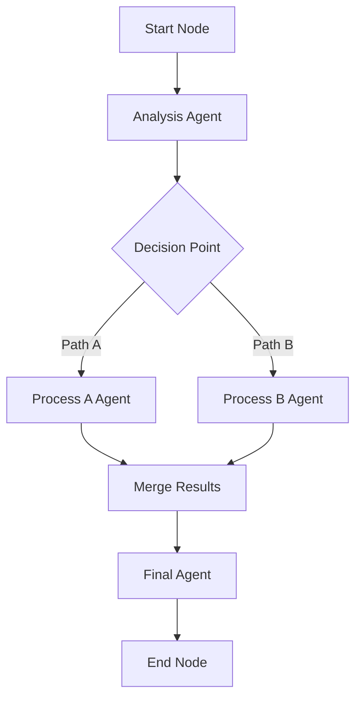

## Performance Considerations

### 1. Streaming Optimization
- Immediate validation of partial responses
- Efficient part management with vendor ID tracking
- Minimal memory overhead for long conversations

### 2. Retry Strategy
- Exponential backoff for transient errors
- Context-aware retry prompts
- Configurable retry limits

### 3. Model Selection
- Fallback chains for reliability
- Cost-optimized model routing
- Dynamic model selection based on task

## Security and Best Practices

### 1. Input Validation
- Pydantic models for all inputs
- Schema validation for tool arguments
- Sanitization of user inputs

### 2. Output Control
- Structured output enforcement
- Response format validation
- Content filtering options

### 3. Dependency Isolation
- Type-safe dependency injection
- Scoped resource management
- Clean separation of concerns

## Conclusion

Pydantic-AI provides a comprehensive framework for building production-grade AI applications with:

- **Strong typing** throughout the system
- **Flexible architecture** supporting multiple models and patterns
- **Robust error handling** with automatic retries
- **Efficient streaming** with real-time validation
- **Clean abstractions** for tools, dependencies, and outputs

The framework's design philosophy prioritizes developer experience while maintaining the flexibility needed for complex AI applications.