# Pydantic-AI: Detailed Component Analysis

## 1. Agent Class Deep Dive

The `Agent` class is the core orchestrator of pydantic-ai. Here's how it works internally:

### Agent Initialization

```python
class Agent[DepsT, ResultT]:
    def __init__(
        self,
        model: Model | str | None = None,
        *,
        deps_type: type[DepsT] = NoneType,
        output_type: type[ResultT] | None = None,
        system_prompt: str | Sequence[str] = (),
        tools: Sequence[Tool[DepsT]] = (),
        retries: int = 1,
        instrument: bool = True,
    ):
        # Initialize model registry
        # Set up tool registry  
        # Configure system prompts
        # Set up validation
```

### Agent Execution Sequence

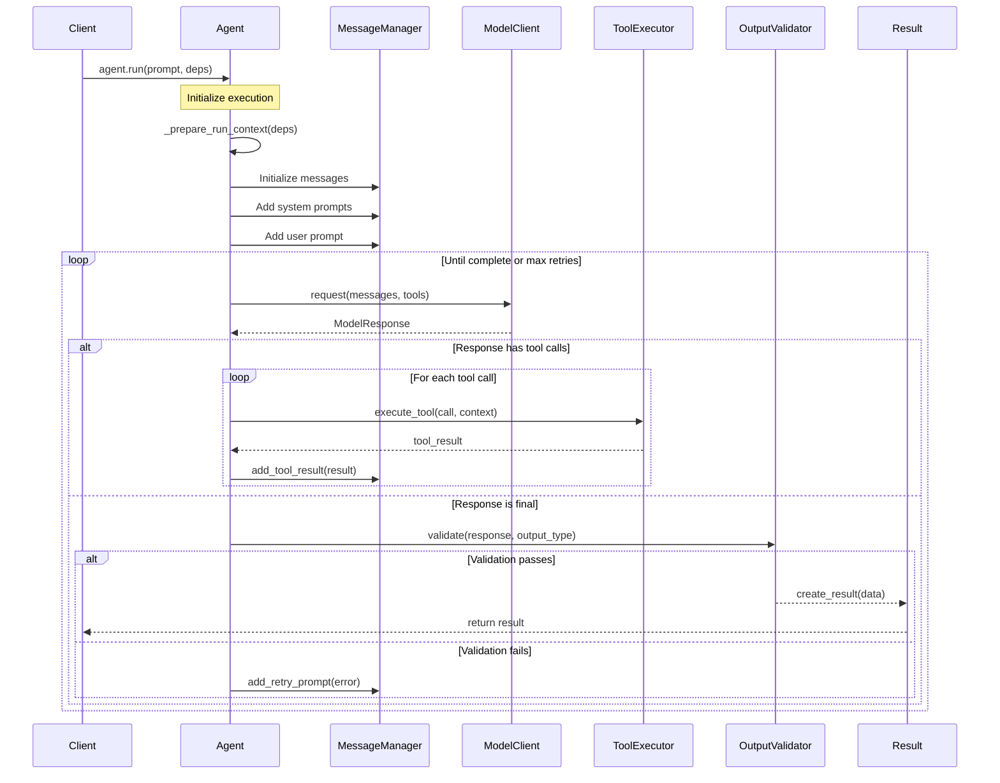

## 2. Tool System Architecture

### Tool Registration and Schema Generation

```mermaid
flowchart TD
    subgraph "Tool Definition"
        FuncDef[Function Definition]
        Decorator[@agent.tool]
        TypeHints[Type Hints]
        Docstring[Docstring]
    end
    
    subgraph "Schema Generation"
        Inspector[Function Inspector]
        SchemaBuilder[Schema Builder]
        ParamExtractor[Parameter Extractor]
        DocParser[Docstring Parser]
    end
    
    subgraph "Tool Registry"
        ToolStore[Tool Store]
        ToolSchema[JSON Schema]
        ToolFunc[Wrapped Function]
    end
    
    FuncDef --> Decorator
    Decorator --> Inspector
    TypeHints --> Inspector
    Docstring --> DocParser
    
    Inspector --> SchemaBuilder
    Inspector --> ParamExtractor
    DocParser --> ParamExtractor
    
    SchemaBuilder --> ToolSchema
    ParamExtractor --> ToolSchema
    
    ToolSchema --> ToolStore
    ToolFunc --> ToolStore
```

### Tool Execution Flow

```python
# Internal tool execution process
async def execute_tool(
    tool_call: ToolCall,
    context: RunContext[DepsT]
) -> ToolResult:
    # 1. Look up tool in registry
    tool = self._tools[tool_call.name]
    
    # 2. Validate arguments against schema
    validated_args = tool.validate_args(tool_call.args)
    
    # 3. Inject context as first parameter
    # 4. Execute tool function
    try:
        result = await tool.func(context, **validated_args)
        return ToolResult(success=True, data=result)
    except Exception as e:
        return ToolResult(success=False, error=str(e))
```

## 3. Dependency Injection System

### RunContext Implementation

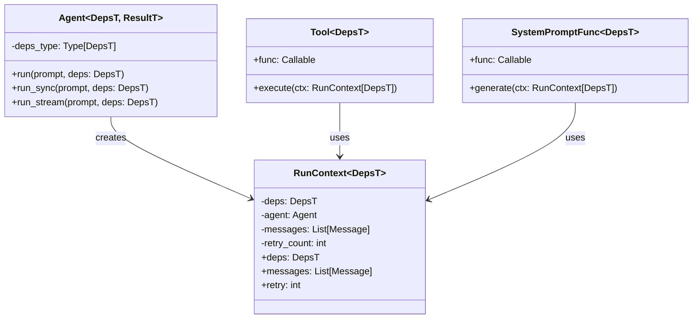

### Dependency Flow

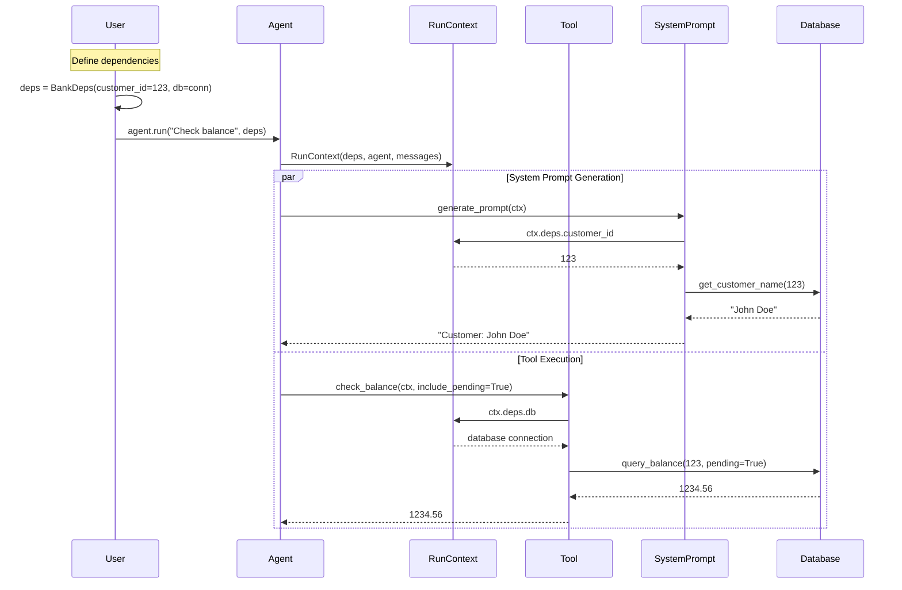

## 4. Message System Internals

### Message Type Hierarchy

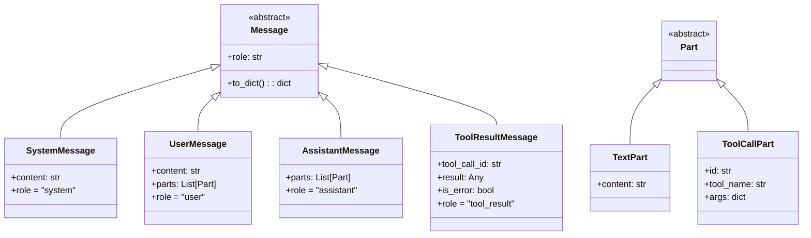

### Message Flow During Execution

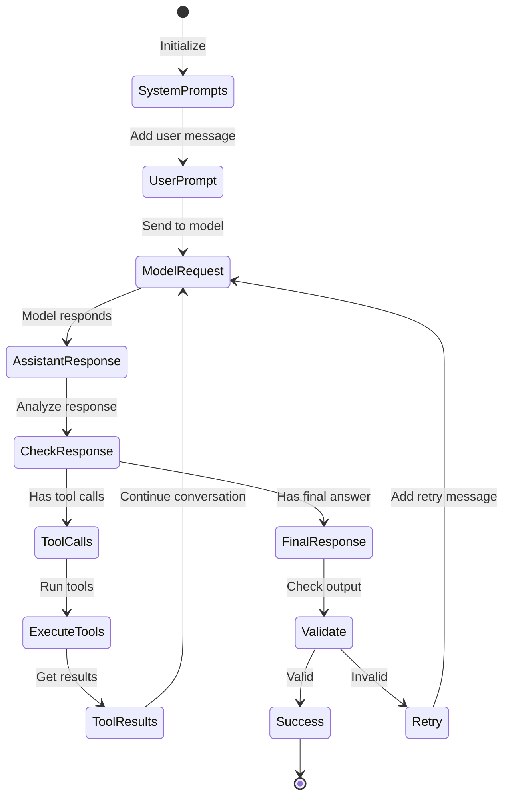

## 5. Streaming Architecture

### Stream Processing Pipeline

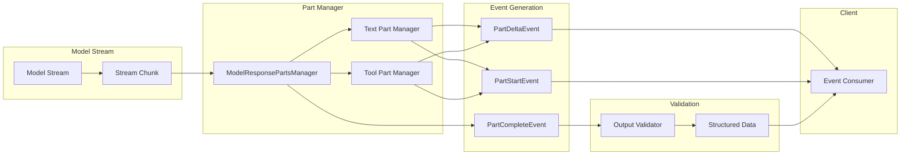

### Streaming Event Types

```python
# Event type definitions
@dataclass
class ModelResponseStreamEvent:
    """Base streaming event"""

@dataclass 
class PartStartEvent(ModelResponseStreamEvent):
    index: int
    part: ModelResponsePart

@dataclass
class PartDeltaEvent(ModelResponseStreamEvent):
    index: int  
    delta: PartDelta

@dataclass
class PartCompleteEvent(ModelResponseStreamEvent):
    index: int
    part: ModelResponsePart

@dataclass
class ModelResponseComplete(ModelResponseStreamEvent):
    response: ModelResponse
```

## 6. Model Abstraction Layer Details

### Model Protocol Definition

```python
class Model(Protocol):
    """Protocol that all model implementations must follow"""
    
    async def request(
        self,
        messages: list[Message],
        *,
        tools: list[ToolDefinition] | None = None,
        response_format: ResponseFormat | None = None,
        **kwargs: Any,
    ) -> ModelResponse:
        """Make a single request to the model"""
        ...
    
    async def request_stream(
        self,
        messages: list[Message],
        *,
        tools: list[ToolDefinition] | None = None,
        response_format: ResponseFormat | None = None,
        **kwargs: Any,
    ) -> AsyncIterator[ModelResponseStreamEvent]:
        """Stream a response from the model"""
        ...
```

### Model Implementation Pattern

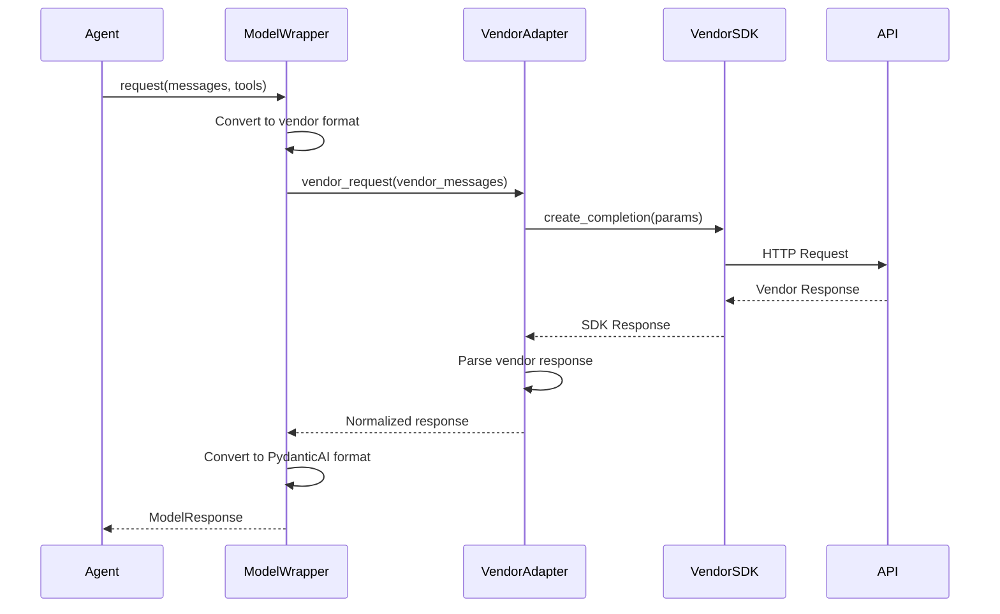

## 7. Error Handling and Retry Mechanism

### Retry State Machine

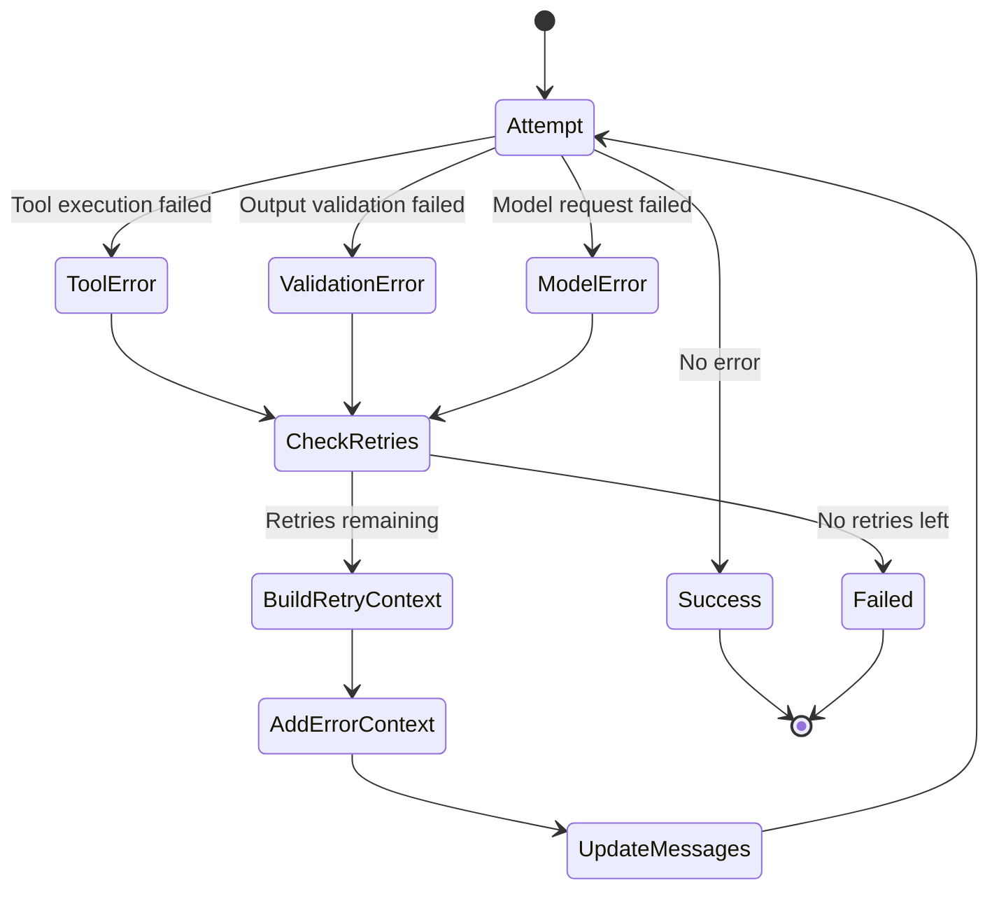

### Error Context Building

```python
def build_retry_context(error: Exception, attempt: int) -> str:
    """Build context message for retry"""
    if isinstance(error, ValidationError):
        return f"Output validation failed: {error}. Please fix and try again."
    elif isinstance(error, ToolError):
        return f"Tool execution failed: {error}. Please handle the error."
    else:
        return f"Error on attempt {attempt}: {error}"
```

## 8. Output Validation Pipeline

### Validation Flow

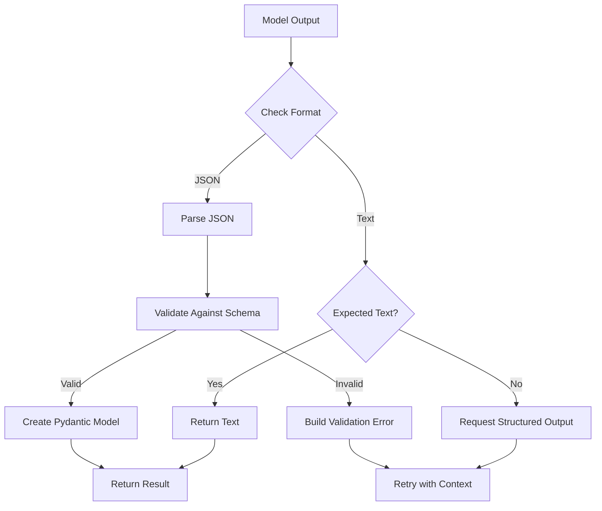

## 9. Performance Optimizations

### Streaming Buffer Management

```python
class StreamBuffer:
    """Efficient buffer for streaming responses"""
    
    def __init__(self):
        self._chunks: deque[str] = deque()
        self._size: int = 0
        self._complete: bool = False
    
    def add_chunk(self, chunk: str):
        self._chunks.append(chunk)
        self._size += len(chunk)
        
        # Consolidate if too fragmented
        if len(self._chunks) > 100:
            self._consolidate()
    
    def _consolidate(self):
        content = ''.join(self._chunks)
        self._chunks.clear()
        self._chunks.append(content)
```

### Connection Pooling

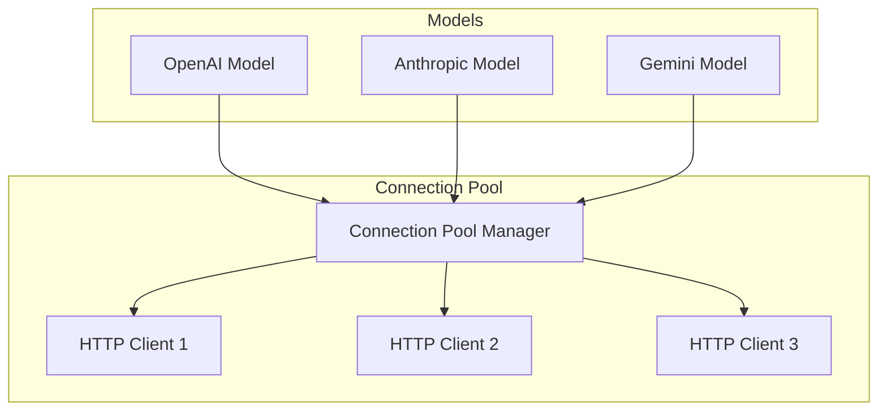

## 10. Testing Support

### Test Fixtures and Mocks

```python
class TestModel(Model):
    """Model implementation for testing"""
    
    def __init__(self, responses: list[ModelResponse]):
        self._responses = responses
        self._call_count = 0
    
    async def request(self, messages, **kwargs) -> ModelResponse:
        response = self._responses[self._call_count]
        self._call_count += 1
        return response
```

### Testing Pattern

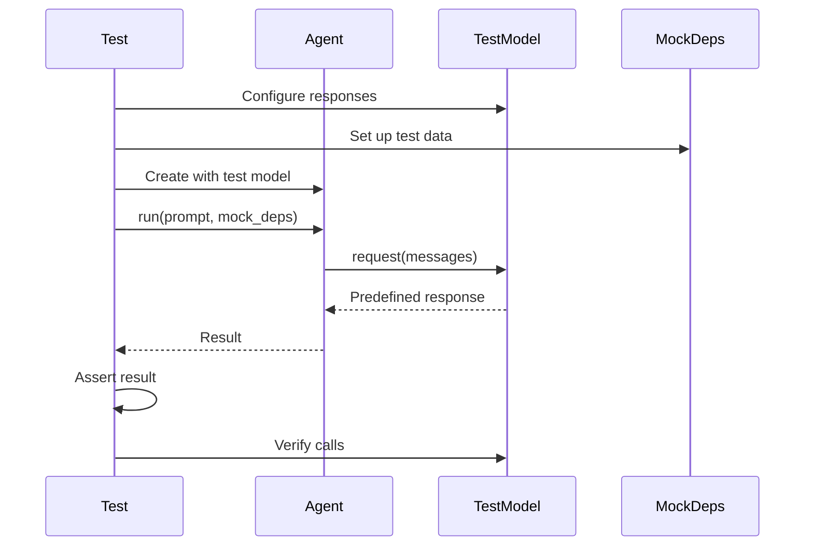