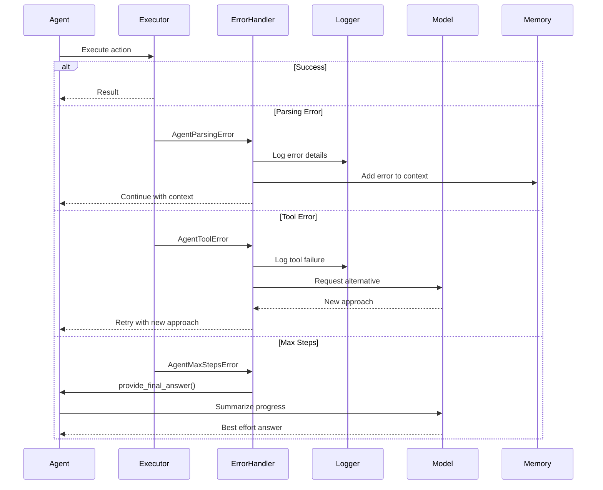

# Comprehensive Analysis of smolagents

## Table of Contents
1. [Overview](#overview)
2. [Architecture Overview](#architecture-overview)
3. [Core Components](#core-components)
4. [Agent Execution Flow](#agent-execution-flow)
5. [Tool System](#tool-system)
6. [Memory and Persistence](#memory-and-persistence)
7. [Model Integration](#model-integration)
8. [Code Execution](#code-execution)
9. [MCP Integration](#mcp-integration)
10. [Remote Execution](#remote-execution)

## Overview

smolagents is a minimalist framework for building AI agents that "think in code". It's designed with simplicity in mind (~1,000 lines of core logic) while providing powerful capabilities:

- **Code-first agents**: Agents write actions as Python code snippets rather than JSON/text
- **Model-agnostic**: Supports any LLM through various integrations
- **Tool-agnostic**: Works with MCP servers, LangChain tools, and Hub Spaces
- **Security-focused**: Sandboxed execution via Docker or E2B
- **Hub integration**: Share and pull tools/agents from Hugging Face Hub

## Architecture Overview


## Core Components

### 1. Agent Hierarchy

The agent system is built on a class hierarchy:


### 2. Key Data Structures


## Agent Execution Flow

### Main Execution Loop


### Code Agent Execution Detail


## Tool System

### Tool Architecture


### Tool Execution Flow


### MCP Tool Integration


## Memory and Persistence

### Memory Management


### Persistence Flow


## Model Integration

### Model Abstraction Layer


### Model Invocation Flow


## Code Execution

### Secure Code Evaluation


### Remote Execution (Docker/E2B)


## MCP Integration

### MCP Server Connection


## Remote Execution

### Docker Execution Flow


### E2B Execution Flow


## Advanced Features

### Multi-Agent Coordination


### Planning and Replanning


## Error Handling and Recovery



## Performance Optimization

### Token Usage Tracking

```mermaid
sequenceDiagram
    participant Agent
    participant Model
    participant TokenCounter
    participant Monitor
    participant Report
    
    loop Each step
        Agent->>Model: Generate
        Model->>TokenCounter: Count input tokens
        Model->>TokenCounter: Count output tokens
        TokenCounter-->>Model: Usage stats
        
        Model-->>Agent: Response + usage
        
        Agent->>Monitor: Update metrics
        Monitor->>Monitor: Aggregate usage
        Monitor->>Monitor: Track timing
    end
    
    Agent->>Monitor: Get summary
    Monitor->>Report: Generate report
    Report-->>Agent: Total usage, costs, timing
```

### Streaming and Real-time Updates

```mermaid
sequenceDiagram
    participant User
    participant Agent
    participant Model
    participant UI
    participant Buffer
    
    User->>Agent: run(task, stream=True)
    
    Agent->>Model: generate_stream()
    
    loop Streaming chunks
        Model-->>Agent: ChatMessageStreamDelta
        Agent->>Buffer: Accumulate content
        Agent->>UI: Update display
        UI-->>User: Live output
        
        alt Tool call detected
            Agent->>Agent: Parse partial tool call
            Agent->>UI: Show tool invocation
        end
    end
    
    Agent->>Agent: Finalize output
    Agent-->>User: Complete result
```

## Security Model

### Import Authorization

```mermaid
graph TB
    subgraph Authorization Check
        Import[Import Request]
        Tree[Import Tree Builder]
        Checker[Authorization Checker]
        
        Import --> Tree
        Tree --> Checker
    end
    
    subgraph Authorized Imports
        Base[BASE_BUILTIN_MODULES]
        Additional[additional_authorized_imports]
        Wildcard[* imports]
    end
    
    subgraph Decision
        Allow[Import Allowed]
        Deny[InterpreterError]
    end
    
    Checker --> Allow
    Checker --> Deny
    
    Base --> Checker
    Additional --> Checker
    Wildcard --> Checker
```

## Conclusion

smolagents provides a powerful yet simple framework for building AI agents. Its key strengths include:

1. **Simplicity**: Core logic in ~1,000 lines of code
2. **Flexibility**: Model and tool agnostic design
3. **Security**: Multiple layers of sandboxing
4. **Extensibility**: Easy to add new models, tools, and executors
5. **Hub Integration**: Seamless sharing and discovery

The framework achieves this through:
- Clean abstractions (Agent, Tool, Model, Executor)
- Modular design with clear separation of concerns
- Comprehensive error handling and recovery
- Rich monitoring and observability
- Multiple deployment options (local, Docker, E2B)

This architecture enables developers to build sophisticated AI agents while maintaining code clarity and safety.